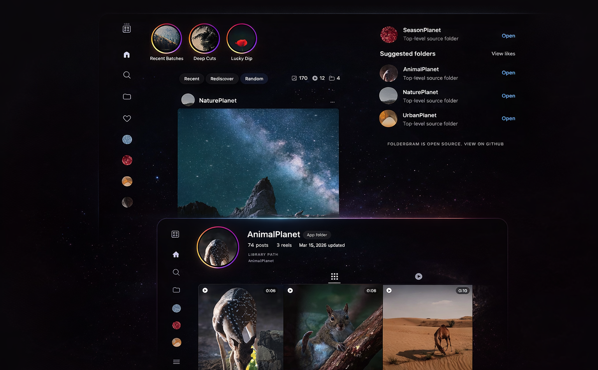

<div align="center">

<a href="https://foldergram.intentdeep.com/">
  
</a>
<br /><br />
<a href="https://foldergram.intentdeep.com/">
  
</a>

# Foldergram

**Local-only photo and video gallery for folders, with an Instagram-inspired browsing pattern.**

[](https://github.com/foldergram/foldergram/pkgs/container/foldergram)
[](https://foldergram.intentdeep.com/)
[](https://nodejs.org/)
[](https://vuejs.org/)
[](https://www.gnu.org/licenses/agpl-3.0)

[Live Demo](https://foldergram.intentdeep.com/) • [Features](#features) • [Installation](#installation) • [Configuration](#configuration) • [Tech Stack](#tech-stack) • [Contributing](CONTRIBUTING.md)

**Try the public demo:** [foldergram.intentdeep.com](https://foldergram.intentdeep.com/)

</div>

---

Foldergram is a self-hosted web application that turns your local folders into a beautiful, instagram-style feed and profile. It turns your local folder to app folders (profiles), and serves a lightning-fast Progressive Web App (PWA).

Foldergram indexes supported media from a configured `GALLERY_ROOT`, stores metadata in SQLite, generates thumbnails and previews, and serves a fast feed-style web app for local browsing. Derivatives can be generated during scans or lazily on first request, and image detail pages can be configured to use generated previews or originals. The current app includes Home, Reels, Explore, Library, Likes, Moments or Highlights, App Folder pages, post detail views, original-media download controls, delete actions, scan controls, and rebuild tools.

Generated derivatives are now stored under stable asset-key shards instead of mirroring source folders. Existing libraries stay readable during upgrade, then migrate in place on the next full scan. During that upgrade, Foldergram keeps stored paths pointed at files that already exist, repairs surviving legacy derivatives where possible, and lets later folder moves preserve the same indexed media identity and reuse existing thumbnails/previews. Scan status distinguishes discovery, derivative migration, and derivative generation so long-running maintenance work can report the right kind of progress for each phase.

## Features

- **Instagram-Inspired UI:** Enjoy a familiar feed layout, dedicated app folders (profiles), and a media viewer.
- Home feed with `Recent`, `Rediscover`, and `Random` modes.
- A dedicated `/reels` route with a video-only queue. Settings can default it to `Recommended`, `Recent`, or `Random`.
- A top rail that shows `Moments` when capture-date coverage is strong, or `Highlights` when it is not.
- Library browsing with App Folder search, sorting, and delete actions.
- App Folder pages with a posts grid and a folder-specific `Reels` tab when videos exist.
- Shared likes in SQLite for signed-in admin/viewer sessions, plus browser-local favorites in public mode.
- Image and video support with configurable eager or lazy derivative generation for fast browsing.
- Original-media download controls on home feed cards, post detail, and stories, alongside open-original actions.
- Optional role-based local access with admin, viewer, and public browse modes.
- Settings split into `General Settings` for Home/Reels defaults, stories mode, and excluded folders, plus `Scan & Library` for scan and rebuild actions.
- Phase-aware scan progress for first indexing, derivative migration, and rebuilds.
- A web app manifest plus production service worker registration.
- A debounced filesystem watcher in development mode only.
- No multi-user accounts, cloud sync, uploads, comments, messaging, notifications, or remote APIs.

## How It Works

Foldergram maps directly to your filesystem:

1. **App Folders:** Any non-hidden folder under `GALLERY_ROOT` that directly contains supported media becomes one indexed App Folder.
2. **Posts:** Each supported image or video directly inside that folder becomes one indexed post.
3. **Nested folders stay separate:** Nested local folders are not merged into their parent App Folder. If a nested folder directly contains supported media, it becomes its own App Folder with parent folder name in the route (e.g. /folder/parent-nested).
4. **Root files are ignored:** Files placed directly in `GALLERY_ROOT` are ignored.

Runtime reads come from SQLite and generated derivatives, not from live filesystem scans on every request.

### Supported Formats

- **Images:** `.jpg`, `.jpeg`, `.png`, `.webp`, `.gif`
- **Videos:** `.mp4`, `.mov`, `.m4v`, `.webm`, `.mkv`

Animated image files keep animation in the post viewer preview and home feed cards. Folder/profile grids and other thumbnail surfaces remain static.

For source installs, video support requires `ffmpeg` and `ffprobe`. The Docker image installs them inside the container.

## Installation

### 🐳 The Easy Way (Docker - Recommended)

This is the recommended path for most users. It uses the pre-built GitHub Container Registry (GHCR) image.

1. Create a folder for Foldergram and move into it:

```bash
mkdir foldergram
cd foldergram
```

2. Download the Compose file:

```bash
wget -O docker-compose.yml https://raw.githubusercontent.com/foldergram/foldergram/main/docker-compose.yml
```

3. Create your first gallery folder:

```bash
mkdir -p data/gallery/example-album
```

4. Move a few photos or videos into `data/gallery/example-album/` to create your first indexed App Folder.
5. Start the container:

```bash
docker compose up -d
```

6. Open `http://localhost:4141`.

In Docker, Foldergram runs in production mode and the app inside the container listens on `4141`. If you need a different host port, change the left side of `4141:4141` in [`docker-compose.yml`](docker-compose.yml).

For the default Docker Compose setup, the container uses the image's built-in
production defaults plus the mounted `./data/...` volumes. The source-install
`.env` file is not read inside the container unless you wire that in yourself.

The shipped Compose file includes `IMAGE_DETAIL_SOURCE: preview` and
`DERIVATIVE_MODE: eager`.

If you want lazy derivatives or original-backed image detail pages in Docker,
edit those values in `docker-compose.yml` before starting the container.

If you want Docker to skip unwanted source folders from the first scan, add
`GALLERY_EXCLUDED_FOLDERS` under the Compose `environment:` block. For example:

```yaml
GALLERY_EXCLUDED_FOLDERS: "@eaDir,thumbnails,Archive/cache"
```

For an optional read-only public demo in Docker, add `PUBLIC_DEMO_MODE: "1"`
under the Compose `environment:` block. If the browser-visible origin differs
from the upstream Node host, also set `CSRF_TRUSTED_ORIGINS` to that public
origin.

### If You Already Cloned This Repository

The repository includes:

- [`docker-compose.yml`](docker-compose.yml) for the GHCR image
- [`docker-compose.local.yml`](docker-compose.local.yml) as a local-build override

To build locally from source instead of pulling from GHCR, run:

```bash
docker compose -f docker-compose.yml -f docker-compose.local.yml up -d --build
```

This command uses the same runtime settings and volumes, but builds the image locally from the repository `Dockerfile`.

### Run from Source

> **Note:** This repository is set up as a workspace. **`pnpm` is preferred** for the best development experience, but standard `npm` is also supported if you prefer the default Node toolchain.

Requirements:

- Node.js 22
- `npm` or `pnpm`
- `ffmpeg` and `ffprobe` if you want video support outside Docker

1. Clone the repository:

```bash
git clone https://github.com/foldergram/foldergram.git
cd foldergram
```

2. Create your local env file:

```bash
cp .env.example .env
```

3. Install dependencies:

```bash
pnpm install
# or
npm install
```

4. Start the development workspace:

```bash
pnpm dev
# or
npm run dev
```

Development ports:

- Client: prefers `http://localhost:4141` and automatically uses the next free port up to `4144`
- API: `http://localhost:4140`
- Docs: `http://localhost:4145`

The Vite client stays within the reserved `4141-4144` range in development, so it can move off `4141` without colliding with the API or docs ports.

If you only want part of the workspace, use:

- `pnpm dev:server`
- `pnpm dev:client`
- `pnpm dev:docs`

For a production build from source:

```bash
pnpm build
pnpm start
# or
npm run build
npm start
```

Then open `http://localhost:4141`.

## Configuration

Default paths come from [`.env.example`](.env.example):

```text
data/
  ├─ gallery/       # Original source media
  ├─ db/
  │   └─ gallery.sqlite
  ├─ thumbnails/    # Generated thumbnails and poster images, sharded by asset key
  └─ previews/      # Generated previews, sharded by asset key
```

`GALLERY_ROOT` only needs read access. `DB_DIR`, `THUMBNAILS_DIR`, and `PREVIEWS_DIR` must be writable.

| Variable                      | Default             | Description                                                               |
| ----------------------------- | ------------------- | ------------------------------------------------------------------------- |
| `NODE_ENV`                    | `development`       | Runtime mode.                                                             |
| `SERVER_PORT`                 | `4141`              | Production Express port.                                                  |
| `DEV_SERVER_PORT`             | `4140`              | Express server port during `pnpm dev`.                                    |
| `DEV_CLIENT_PORT`             | `4141`              | Base Vite client port during `pnpm dev`. The client may use up to `4144`. |
| `DATA_ROOT`                   | `./data`            | Root directory for app-managed storage.                                   |
| `GALLERY_ROOT`                | `./data/gallery`    | Root directory scanned for App Folders.                                   |
| `GALLERY_EXCLUDED_FOLDERS`    | empty               | Comma-separated folder exclusion rules such as `@eaDir,Archive/cache`.    |
| `DB_DIR`                      | `./data/db`         | SQLite database directory.                                                |
| `THUMBNAILS_DIR`              | `./data/thumbnails` | Generated thumbnail output directory.                                     |
| `PREVIEWS_DIR`                | `./data/previews`   | Generated preview output directory.                                       |
| `IMAGE_DETAIL_SOURCE`         | `preview`           | For image detail pages, use generated previews or stream originals.       |
| `DERIVATIVE_MODE`             | `eager`             | Generate derivatives during scans or lazily on first request.             |
| `LOG_VERBOSE`                 | `0`                 | Truthy values are `1`, `true`, `yes`, and `on`.                           |
| `SCAN_DISCOVERY_CONCURRENCY`  | `4`                 | Folder discovery concurrency.                                             |
| `SCAN_DERIVATIVE_CONCURRENCY` | `4`                 | Derivative generation concurrency.                                        |
| `PUBLIC_DEMO_MODE`            | `0`                 | When enabled, all API mutations become read-only and return `403`.        |
| `CSRF_TRUSTED_ORIGINS`        | empty               | Comma-separated extra browser origins allowed for mutating API requests.  |

`DATA_ROOT` is the base path for the app's local storage layout. If you set
only `DATA_ROOT`, Foldergram will default the other storage paths to
`<DATA_ROOT>/gallery`, `<DATA_ROOT>/db`, `<DATA_ROOT>/thumbnails`, and
`<DATA_ROOT>/previews`. Set `GALLERY_ROOT`, `DB_DIR`, `THUMBNAILS_DIR`, or
`PREVIEWS_DIR` separately only when you need a non-standard layout.

Docker uses the fixed internal container port `4141`, and other production
runtimes continue to use `SERVER_PORT`, which defaults to `4141` in the Docker
image.

For the default Docker Compose setup, runtime variables are defined in
[`docker-compose.yml`](docker-compose.yml). The source-install `.env` file is
not read directly by the container.

### Excluded Folders

- Use `GALLERY_EXCLUDED_FOLDERS` to skip unwanted source folders during discovery and rescans.
- Rules without a slash match a folder name anywhere in the gallery tree, such as `@eaDir` or `thumbnails`.
- Rules with a slash match one exact relative folder path beneath `GALLERY_ROOT`, such as `Archive/cache`.
- The Settings sidebar now separates app-wide preferences into `General Settings`. That section includes the stories-folders toggle, Home/Reels defaults, and the excluded-folder editor.
- `General Settings` can add or remove custom exclusion rules at runtime. Env-backed rules stay read-only there and still require a restart to change.
- After changing excluded folders or stories mode in `General Settings`, run a full library scan from `Scan & Library` so previously indexed folders are soft-removed or reclassified correctly.

### Detail Media and Derivative Timing

- `IMAGE_DETAIL_SOURCE=preview` keeps image detail pages on generated previews.
- `IMAGE_DETAIL_SOURCE=original` makes image detail pages stream `/api/originals/:id`.
- `DERIVATIVE_MODE=eager` generates thumbnails and previews during scans.
- `DERIVATIVE_MODE=lazy` indexes metadata during scans, then generates missing files the first time `/thumbnails/...` or `/previews/...` is requested and caches them on disk.

These flags are independent:

- feed cards, folder grids, avatars, and other list surfaces still use generated derivatives
- `IMAGE_DETAIL_SOURCE` affects images only; videos still default to preview playback
- `Rebuild Library Index` refreshes the SQLite-backed index; in lazy mode it does not pre-generate missing derivatives
- `Regenerate Thumbnails` remains a manual thumbnail and video-poster rebuild only; it does not rebuild previews

### Access Protection

Access protection is configured from the Settings page, not from `.env`.

The current implementation supports:

- `admin` sessions with full access
- `viewer` sessions with shared likes but no Settings, Trash, scans, rebuilds, or delete actions
- `anonymous` public sessions with browse-only access and browser-local favorites
- `viewer_access_mode=off` for admin-only access
- `viewer_access_mode=password` for a separate viewer password
- `viewer_access_mode=public` for anonymous browsing plus admin unlock from `More`

Foldergram stores one-way password hashes plus signed session metadata in SQLite. In public mode, anyone who can reach the app can browse immediately, favorites stay in the current browser only, and admins can elevate back into full access from `More` with the admin password.

### Public Demo Deployments

To run Foldergram as a public read-only demo, set the following in `.env`:

```env
NODE_ENV=production
PUBLIC_DEMO_MODE=1
CSRF_TRUSTED_ORIGINS=https://foldergram.intentdeep.com
```

`PUBLIC_DEMO_MODE=1` blocks every `POST`, `PUT`, `PATCH`, and `DELETE` request
under `/api`, including future routes. `CSRF_TRUSTED_ORIGINS` is
only needed when the browser-visible origin differs from the upstream Node host seen by Express, such as behind a reverse proxy or HTTPS terminator.

## Tech Stack

**Backend**

- Node.js 22 + Express 5 + TypeScript
- SQLite via `node:sqlite`
- Sharp for image derivatives
- FFmpeg and FFprobe for video processing
- Chokidar for the development watcher
- Zod for runtime validation

**Frontend**

- Vue 3
- Vite
- Vue Router 4
- Pinia
- UnoCSS

**Workspace**

- `pnpm` monorepo

## Scripts

- `pnpm dev`
- `pnpm dev:server`
- `pnpm dev:client`
- `pnpm dev:docs`
- `pnpm build`
- `pnpm start`
- `pnpm test`
- `pnpm rescan`

## Contributing

Foldergram welcomes small, clearly aligned pull requests for bug fixes, documentation, tests, and focused polish.

Before working on major features, architectural changes, or changes to core behavior such as scanning, indexing, routing, auth or access flow, and storage strategy, open an issue or discussion first. Pull requests for large changes that were not discussed in advance will not be accepted.

See [CONTRIBUTING.md](CONTRIBUTING.md) for the full contribution policy, local setup notes, branch naming guidance, and pull request expectations.
